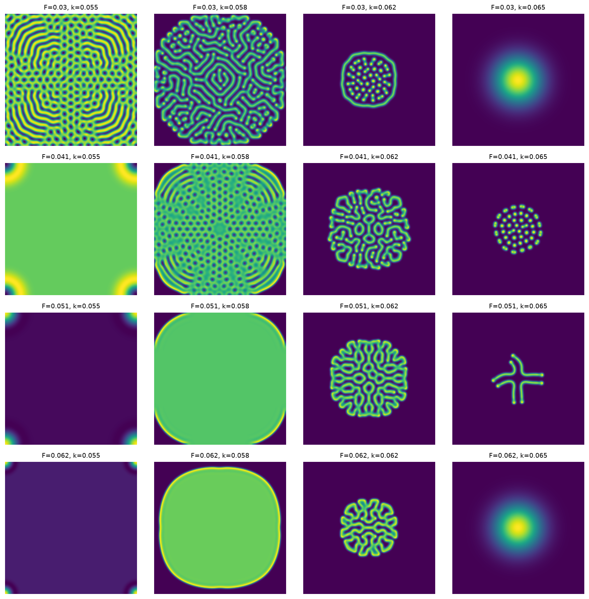

# Gray-Scott

A Gray-Scott reaction-diffusion simulation, written twice: once in Julia, once in Python. I mostly built this to learn Julia, and I was curious how a plain hand-written loop would hold up against vectorized NumPy.



16 runs over a grid of feed/kill rates. Same starting point every time, only `F` and `k` change. Some of them turn into spots, some into stripes, and a few just die out.

## What it does

Two chemicals, `U` and `V`, on a 256x256 grid that wraps around at the edges. `V` eats `U` and multiplies, `U` gets topped up, and both spread out over time:

```
du/dt = Du*∇²u - uv² + F(1-u)
dv/dt = Dv*∇²v + uv² - (F+k)v
```

5-point Laplacian, forward Euler, `dt = 1.0`. Everything starts from a small noisy square in the middle. `Du`, `Dv` and `dt` are hardcoded. `F` and `k` are the fun ones, they're what decides which pattern you get.

The two versions go about it in opposite ways, on purpose:

- **Julia** ([julia/src/GrayScott.jl](julia/src/GrayScott.jl)): a straight loop over every cell, two buffers that get swapped each step, nothing allocated inside the loop.
- **Python** ([python/src/gray_scott.py](python/src/gray_scott.py)): fully vectorized with `np.roll` and no loops at all, because looping over 256x256x5000 cells in Python would take hours.

## Running it

```bash
pip install -r requirements.txt   # numpy, matplotlib

# Julia sweep -> output/julia/*.bin + manifest.csv
cd julia && julia scripts/run_sweep.jl

# Python sweep -> output/python/
python python/scripts/run_sweep.py

# plot (reads output/julia by default)
python util/plot.py
```

Grids get dumped as raw `Float64`. Julia writes them column-major, so `plot.py` reads them back with `order="F"`.

## Benchmarks

N=256, 5000 steps, F=0.060, k=0.062. Intel i5-1145G7, Julia 1.12.6, Python 3.14.4 / NumPy 2.5.1. Best of 5.

| | median | min | allocations |
|---|---|---|---|
| Julia | 3.52 s | 3.49 s | 2.00 MiB (12 allocs) |
| Python + NumPy | 7.64 s | 7.57 s | ~12 temporary arrays *per step* |

So about **2.2x faster**, which honestly is less than I expected going in. NumPy is running the same arithmetic in C, so the difference isn't really about the language, it's about memory traffic. Every Python step allocates and streams a dozen 512 KB temporary arrays, while Julia does one pass with the values sitting in registers.

The 2 MiB on the Julia row is just the four grids allocated at the start. The loop itself allocates nothing.

Adding `@inbounds` to the inner loop was worth **1.56x** by itself (0.56 s down to 0.36 s at 500 steps). That's more than the bounds checks actually cost to run, and I think the rest comes from the loop body getting smaller and easier for the compiler to schedule once the branch-to-throw is gone.

## Known weak spots

- **The two versions don't produce the same output.** Julia uses uniform noise (`rand()`), Python uses Gaussian (`standard_normal`), and Julia's starting square is `2r+1` wide while Python's is `2r`. The pictures look similar in spirit, but you can't compare them run to run.
- **Julia's RNG isn't seeded**, so its runs aren't reproducible. Python seeds with 0. This one is just an oversight.
- **`mod1` sits right in the hot loop.** Four integer divisions per cell purely to handle the wraparound, and it stops the whole loop from vectorizing. Biggest cost that's left.
- **`@inbounds` is a promise nobody checks.** It's fine today because `mod1(x, N)` always lands in `1:N`, but nothing re-verifies that if the stencil ever changes. Typing `mod` instead of `mod1` would read out of bounds silently instead of throwing.
- **Single-threaded**, on a machine with 8 threads.
- **`plot.py` has `output/julia` hardcoded**, so you have to edit the file to plot the Python results.
- **No tests.** Nothing checks that the two versions agree, or that a refactor didn't quietly change the physics.
- The Julia side isn't a proper package (`Project.toml` has no name or uuid), the scripts just `include` it.

## Ideas for later

- Split the loop into the interior (`2:N-1`, plain `i±1` offsets) and the four edges. That gets `mod1` out of the hot path and should let it vectorize.
- `@threads` on the outer `j` loop. The update is embarrassingly parallel thanks to the double buffering.
- Seed Julia's RNG and match the noise distribution and square size, so the two versions can actually be compared.
- Let `plot.py` take a directory argument.
- A small test that runs both at a low N and compares them, so the `@inbounds` promise is checked by something.
- Run things once under `julia --check-bounds=yes` after touching any of the index math.
